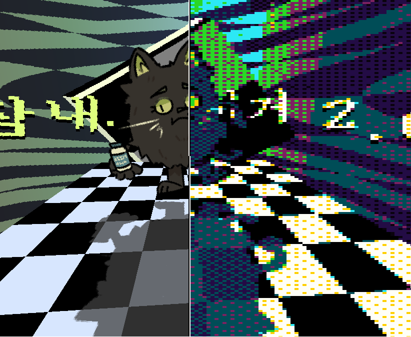
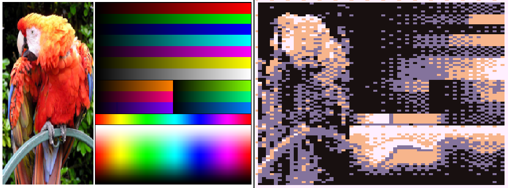

# :rainbow:LUT-based colour quantization & dithering effect example:rainbow:
**Made & powered by GameMaker : Studio 1 and GLSL ES**

# Description
This example / tech demo demonstrates the usage of post-processed dither filter shader, That utilizes LUT for colour quantization.
Although all of the preview has their downscaling / pixelization effect applied to emulate the "retro" look, The effect itself can be applied without downscaling just fine.

# How to use
The folder `colourquantizationshaderthatwillmakeyoureyesbleed.gmx` contains the example project for use in GameMaker : Studio 1.
Although it was made in GMS:1, Importing it into the GameMaker : Studio 2 would be fairly trivial.

Additionally, The repository also contains the pre-compiled, interactive demo executable of the project called `interactive_demo.exe` that you can open it up & interact with your mouse & `numeric key 1~5` and `ctrl + s, ctrl + o` key on your keyboard.

The project contains few shaders that does all the LUT & dithering magic :
| shader | description |
|-|-|
| `shd_gen_lut_from_array` | Generates LUT data from provided vec3 colour array with size of 16. The LUT may contain the 1st. closest colour on the palette for each colours and the 2nd. closest colour on the palette depending on the value of `uSecondClosestBlendFactor` uniform. |
| `shd_gen_lut_from_texture` | Generates LUT data from provided palette texture with dimension of `16x1px`. The LUT may contain the 1st. closest colour on the palette for each colours and the 2nd. closest colour on the palette depending on the value of `uSecondClosestBlendFactor` uniform. |
| `shd_dither_from_lut` | Post-processing effect. Applies colour quantization from provieded 2 LUT textures, And uses threshold matrix map to emulate the "retro" look. Best used with downscaled / pixelated images. |

The project also contains various helper scripts to ease your LUT-creating & applying process :

| script | description |
|-|-|
| `zlut_init()` | Declares various shader's uniform-related variables. This must be called before you use the scripts below! |
| `zlut_build_from_texture(<palette texture>, <resolution of LUT>, <number of LUT's cells>)` | Builds two LUTs (one for 1st. closest colour on the palette, another for 2nd. closest colour) from provided palette texture (the texture should have dimensions of 16x1px, optimally), And returns an array containing the sprite and it's texture pointer for both LUTs. |
| `zlut_build_from_array(<palette array>, <resolution of LUT>, <number of LUT's cells>)` | Builds two LUTs (same as above) from provided palette array (that contains the colours of palette, and the array should have 16 entries, optimally), And returns an array containing the sprite and it's texture pointer for both LUTs. |
| `zlut_set_dithering_shader(<screen width>, <screen height>, <resolution of LUT>, <number of LUT's cells>, <threshold matrix texture>, <LUT texture 1>, <LUT texture 2>)` | Helper function for setting the dithering effect : Sets shader to dithering shader using `shader_set()` function and sets up the necessary uniforms. For Threshold matrix texture, You can pass in the bayer matrix textures or any other threshold patterns in texture form. For both LUT textures, You can pass in the LUTs that you've obtained via `zlut_build_from_texture()` or `zlut_build_from_array()` and for number of LUT's cells and resolutions, It must have same value as the value you've passed in to those scripts. |

Refer to the example project in `colourquantizationshaderthatwillmakeyoureyesbleed.gmx` folder for further details on the usage of the shaders & scripts.
If you have any problems or questions regarding the project, Feel free to let me know. You can contact me via my Discord DMs (`zik#6629`) or my twitter's DM (`@ZIKBAKGURI`)

# Quick links
* [Link to the shader `shd_gen_lut_from_texture`'s source](colourquantizationshaderthatwillmakeyoureyesbleed.gmx\shaders\shd_gen_lut_from_texture.shader)
* [Link to the shader `shd_gen_lut_from_array`'s source](colourquantizationshaderthatwillmakeyoureyesbleed.gmx\shaders\shd_gen_lut_from_array.shader)
* [Link to the shader `shd_dither_from_lut`'s source](colourquantizationshaderthatwillmakeyoureyesbleed.gmx\shaders\shd_dither_from_lut.shader)

# Sources & Materials
## Related readings
* Joel Yliluoma(Bisqwit)'s arbitrary-palette positional dithering algorithm : https://bisqwit.iki.fi/story/howto/dither/jy/
* Wikipedia's page on dithering : https://en.wikipedia.org/wiki/Dither
* Alex Charlton's Dithering on the GPU : http://alex-charlton.com/posts/Dithering_on_the_GPU/
## Assets used
* Font : 삼국지3 글꼴 (Sam3KRFont) : https://github.com/hurss/fonts
* Test image from Wikipedia page : https://en.wikipedia.org/wiki/List_of_software_palettes
* Test image from Yliluoma(Bisqwit)'s page : https://bisqwit.iki.fi/story/howto/dither/jy/#Appendix%203ColorComparisons

## Palettes used for the preview images
* **Flashy 9** palette by loooooogan foooooorman / dev_dwarf : https://lospec.com/palette-list/flashy-9
* **ZXARNE 5.2** palette by Arne : https://lospec.com/palette-list/zxarne-5-2
* **PICO-8** palette by Lexaloffle Games : https://lospec.com/palette-list/pico-8
* **Commodore 64** palette by Commodore : https://lospec.com/palette-list/commodore64
* **Pokemon (SGB)** palette by Nintendo : https://lospec.com/palette-list/pokemon-sgb
* **The Legend of Zelda: Link's Awakening DX (SGB)** palette by Nintendo : https://lospec.com/palette-list/links-awakening-sgb
* **CGA 1 (high)** palette by IBM : https://lospec.com/palette-list/cga-palette-1-high

Everything else were created by me.

# Gallery

