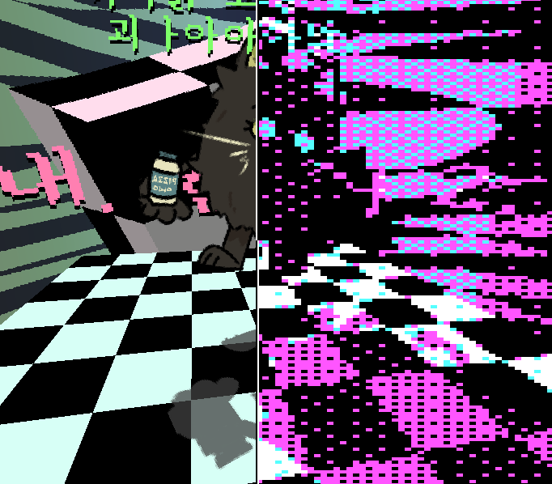

# :rainbow:LUT-기반 색상 양자화 & 디더링 효과 예제:rainbow:
**GameMaker : Studio 1 와 GLSL ES로 제작되었습니다.**

# 설명
이 예제/테크 데모는 LUT를 이용해 색상을 양자화 시키고, 디더링을 적용하는 포스트 프로세싱 쉐이더를 이용해 그래픽에 "레트로" 느낌의 효과를 주는 예제입니다.
대부분의 예제 GIF에서는 효과를 준 부분의 화질을 일부러 낮게 만들어 화질구지(..)한 효과를 주었지만, 이는 단순히 더욱 옛날풍 그래픽처럼 보이기 위함이며 고사양의 그래픽도 충분히 적용 가능합니다.

# 프로젝트 설명
리포지토리 속 `colourquantizationshaderthatwillmakeyoureyesbleed.gmx` 폴더는 GameMaker : Studio 1에서 사용 가능한 프로젝트의 소스 폴더입니다.
비록 프로젝트 자체는 게임메이커 1로 제작되었지만, 게임메이커 2로 어렵지 않게 포팅하셔서 쓰실 수 있을겁니다.

또한, 미리 컴파일된 실행 파일 `interactive_demo.exe`도 리포지토리에 같이 포함되어 있으니 실행시켜서 여러분의 마우스와 키보드 `숫자 키 1~5` 그리고 `ctrl + s, ctrl + o`키를 통해 상호작용 해보실 수 있습니다.

이 프로젝트는 LUT를 생성하고 디더링 효과를 적용하는 몇가지의 쉐이더를 포함하며, 이는 다음과 같습니다 :

| 쉐이더 | 설명 |
|-|-|
| `shd_gen_lut_from_array` | 주어진 vec3의 형태로 색상이 담긴 16의 크기를 가지는 uniform 배열을 기반으로 색상 양자화에 사용 가능 한 LUT 데이터를 생성해 출력합니다. LUT는 주어진 색상 배열 중 가장 가까운 색들의 정보를 포함하며, `uSecondClosestBlendFactor` uniform 변수가 0일 때 가장 가까운 색, 1일 때는 두 번째로 가까운 색을 출력합니다. |
| `shd_gen_lut_from_texture` | 주어진 팔레트 색상이 담긴 sampler2D 텍스쳐를 기반으로 색상 양자화에 사용 가능 한 LUT 데이터를 생성해 출력합니다. 팔레트 텍스쳐는 최대 `16x1px`의 크기를 사용하기를 권장하지만 쉐이더를 변형함으로써 이 제한을 바꿀 수 있습니다. LUT는 주어진 색상 배열 중 가장 가까운 색들의 정보를 포함하며, `uSecondClosestBlendFactor` uniform 변수가 0일 때 가장 가까운 색, 1일 때는 두 번째로 가까운 색을 출력합니다. |
| `shd_dither_from_lut` | 디더링 효과와 색상 양자화 효과를 입히는 포스트 프로세싱 쉐이더입니다. 주어진 2가지의 LUT 텍스쳐와 임곗값 행렬(베이어 패턴)을 이용해 "레트로"풍의 효과를 줍니다. 위 예제와 같이 저해상도의 그래픽과 쓰시면 더욱 옛날풍의 그래픽을 구현하실 수 있습니다. |

또한, 이 프로젝트는 LUT를 제작하고 효과를 주는 데 도움을 줄 수 있는 여러 스크립트들을 포함합니다 :

| script | description |
|-|-|
| `zlut_init()` | 쉐이더 관련 변수들을 선언합니다. 아래의 스크립트를 사용하기 이전에 호출해 주세요! |
| `zlut_build_from_texture(<팔레트 텍스쳐>, <LUT의 텍스쳐 높이 & 너비 (공통)>, <LUT의 칸 수>)` | 주어진 팔레트 텍스쳐를 기반으로 색상 양자화에 사용되는 2개의 LUT 텍스쳐를 생성해, 이를 스프라이트로 만든 결과를 텍스쳐 포인터와 함께 배열에 담아서 반환합니다. 팔레트 텍스쳐는 최대 `16x1px`크기를 사용하는것을 권장합니다. |
| `zlut_build_from_array(<팔레트 배열>, <LUT의 텍스쳐 높이 & 너비 (공통)>, <LUT의 칸 수>)` | 주어진 팔레트 배열을 기반으로 색상 양자화에 사용되는 2개의 LUT 텍스쳐를 생성해, 이를 스프라이트로 만든 결과를 텍스쳐 포인터와 함께 배열에 담아서 반환합니다. 팔레트 배열은 16개의 색상을 포함한 형태의 배열을 사용하는것을 권장합니다. |
| `zlut_set_dithering_shader(<화면 너비>, <화면 높이>, <LUT의 텍스쳐 높이 & 너비 (공통)>, <LUT의 칸 수>, <임곗값 행렬 (Bayer matrix) 텍스쳐>, <LUT 텍스쳐 1>, <LUT 텍스쳐 2>)` | 디더링 효과를 적용하기 위해 사용 가능한 도우미 스크립트입니다. `shader_set()` 함수를 통해 디더링 효과 쉐이더를 현재 쉐이더로 설정하고, 쉐이더가 작동하는데 필요한 여러 uniform 변수들을 설정합니다. `<임곗값 행렬 텍스쳐>` 매개변수로는 예제와 같이 Bayer matrix의 값이 담긴 텍스쳐를 매개변수로 넘기시면 되고, Bayer matrix가 아닌 다른 유사한 임곗값 텍스쳐도 사용 가능합니다. `<LUT 텍스쳐 1>` 과 `<LUT 텍스쳐 2>` 매개변수로는 앞서 말한 `zlut_build_from_texture()` 함수나 `zlut_build_from_array()` 함수를 통해 얻은 텍스쳐 포인터를 넘기시면 되고, 마찬가지로 `<LUT의 텍스쳐 높이 & 너비 (공통)>`와 `<LUT의 칸 수>` 매개변수는 앞에서의 함수에 넘긴 값들과 동일하게 설정하시면 됩니다. |

쉐이더와 스크립트들의 더 자세한 사용 예제를 보고 싶으시다면 `colourquantizationshaderthatwillmakeyoureyesbleed.gmx` 폴더를 참고하세요.

만약에 이 프로젝트와 관련해 여러 의문점이나 버그와 같은 문제점을 제보하고 싶으시다면, 
디스코드 (`zik#6629`)나 제 트위터 (`@ZIKBAKGURI`) 계정을 통해 메시지를 주시면 제 능력 선에서 최대한 도와드리겠습니다. 
`(※ 2020/05/05) : 지금 이 글을 작성하는 현재 시각으로썬 대학교에서 중간고사를 시행하기에 즉각적인 대답을 하지 못할 수 있으니, 양해 부탁드립니다 OTL`

# 빠른 링크
* [Link to the shader `shd_gen_lut_from_texture`'s source](colourquantizationshaderthatwillmakeyoureyesbleed.gmx/shaders/shd_gen_lut_from_texture.shader)
* [Link to the shader `shd_gen_lut_from_array`'s source](colourquantizationshaderthatwillmakeyoureyesbleed.gmx/shaders/shd_gen_lut_from_array.shader)
* [Link to the shader `shd_dither_from_lut`'s source](colourquantizationshaderthatwillmakeyoureyesbleed.gmx/shaders/shd_dither_from_lut.shader)

# 참고한 자료들과 에셋들
## 관련 문서
* Joel Yliluoma(Bisqwit)'s arbitrary-palette positional dithering algorithm : https://bisqwit.iki.fi/story/howto/dither/jy/
* Wikipedia's page on dithering : https://en.wikipedia.org/wiki/Dither
* Alex Charlton's Dithering on the GPU : http://alex-charlton.com/posts/Dithering_on_the_GPU/
## 사용한 에셋
* 삼국지3 글꼴 (Sam3KRFont) : https://github.com/hurss/fonts
* Wikipedia 문서에 사용된 색상 테스트 이미지 : https://en.wikipedia.org/wiki/List_of_software_palettes
* Yliluoma(Bisqwit)의 문서에 사용된 색상 테스트 이미지 : https://bisqwit.iki.fi/story/howto/dither/jy/#Appendix%203ColorComparisons

## Palettes used for the preview images
* **Flashy 9** 팔레트 by loooooogan foooooorman / dev_dwarf : https://lospec.com/palette-list/flashy-9
* **ZXARNE 5.2** 팔레트 by Arne : https://lospec.com/palette-list/zxarne-5-2
* **PICO-8** 팔레트 by Lexaloffle Games : https://lospec.com/palette-list/pico-8
* **코모도어 64** 팔레트 by 코모도어 : https://lospec.com/palette-list/commodore64
* **포켓몬 (슈퍼 게임보이판)** palette by 닌텐도 : https://lospec.com/palette-list/pokemon-sgb
* **젤다의 전설 : 꿈꾸는 섬 DX (슈퍼 게임보이판)** palette by 닌텐도 : https://lospec.com/palette-list/links-awakening-sgb
* **CGA 1 (high)** 팔레트 by IBM : https://lospec.com/palette-list/cga-palette-1-high

이외 모든 에셋은 제가 손수 제작하였습니다.

# 갤러리

